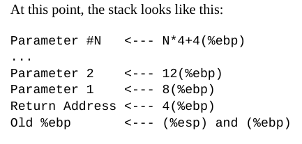
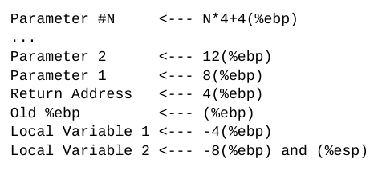

# Functions

(P. 53 onwards)

We use the C calling conventions.

In C calling convention, the stack is the key element for implementing a function's local vars, params, and return address

`pushl` etc: Move either a value or an adress to the top of the stack

`%esp` Always points to top of the stack

Each `pushl` subtracts `%esp` by 4 (stack grows downward)

`popl` gets top value and adds 4 to `%esp`

`movl (%esp), %eax`: () = indirect addressing mode, puts stack value into `%eax`

`movl 4(%esp), %eax`: Moves value 4 bytes below t.o.stack into `%eax`

`%ebp`: Base pointer: special register used for accessing function params and local variables

Function workflow: P. 54 f.



Reserve space: Move the stack pointer down, e.g.:
`subl $8, %esp`

Stack with local var storage:



Function call:
- Store return value in `%eax`
- Reset stack to what it was when function was called
- Return back control to caller (`ret` instruction)
```
movl %ebp, %esp
popl %ebp
ret
```

All registers except `%ebp` will be wiped out.